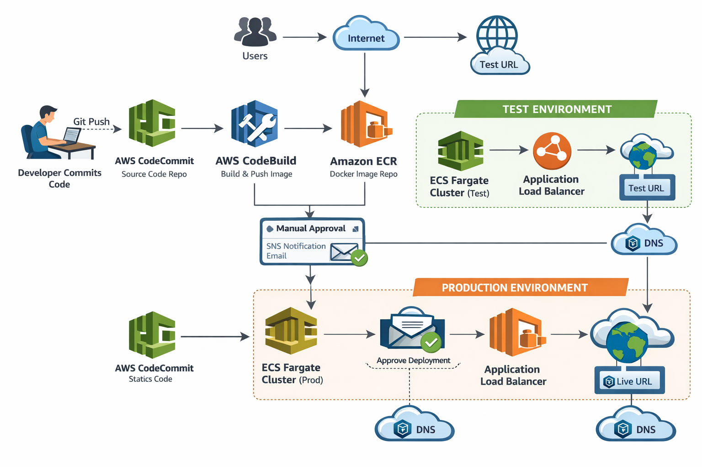

# AWS CI/CD Pipeline for Microservices using CodeCommit, CodeBuild, ECR, ECS Fargate & ALB

## Project Overview

This project demonstrates a **complete end-to-end CI/CD pipeline on AWS** for deploying a **containerized microservice** using modern DevOps best practices.

The pipeline automates the entire workflow — from **code commit to production deployment** — including testing, manual approval, load balancing, and DNS routing.  
The architecture follows a **microservices approach**, not a monolithic design.

---

## Architecture Summary

### High-Level Flow

Developer → CodeCommit → CodeBuild → ECR → ECS (Test) → Manual Approval (SNS) → ECS (Production) → Application Load Balancer → Internet (DNS)

Both **Test** and **Production** environments:
- Use **Amazon ECS Fargate**
- Have their own **Application Load Balancer**
- Are accessible via **DNS**

---

## Repository Structure
 ├── Dockerfile
 
 ├── buildspec.yml
 
 ├── README.md
 
 └── diagrams/
 
        └── architecture-diagram.png

---

## 1. Source Control – AWS CodeCommit

- AWS CodeCommit is used as the **Git repository**
- Stores:
  - `Dockerfile`
  - `buildspec.yml`
  - Application source files
- Any commit (especially changes to the Dockerfile) **automatically triggers the CI/CD pipeline**

---

## 2. Containerization – Docker

The application is a **static website** served using **Apache HTTP Server** inside a Docker container.

### Dockerfile Responsibilities:
- Use Ubuntu as base image
- Install Apache and required tools
- Download and extract a website template
- Expose port `80`
- Run Apache in foreground

Each commit results in a **new immutable Docker image**, supporting microservice principles.

---

## 3. Container Registry – Amazon ECR

- Amazon ECR stores Docker images built by CodeBuild
- Images are versioned using tags
- ECS task definitions pull images directly from ECR

---

## 4. Build Automation – AWS CodeBuild

AWS CodeBuild performs the following tasks:

- Authenticate with Amazon ECR
- Build Docker image using Dockerfile
- Push image to ECR
- Generate `imagedefinitions.json` for ECS deployment
- Upload logs to CloudWatch

**Privileged mode** is enabled to allow Docker builds.

---

## 5. ECS Clusters – Test & Production

Two separate **ECS Fargate clusters** are created.

### Test Cluster
- Automatically deployed after each build
- Used for functional validation
- Accessible via Test DNS

### Production Cluster
- Deployment requires manual approval
- Highly available and scalable
- Public-facing
- Accessible via Production DNS

---

## 6. ECS Task Definitions

Separate task definitions are created for:
- Test environment
- Production environment

Each task definition includes:
- Docker image from ECR
- CPU and memory configuration
- Container port mappings
- Logging configuration
- ECS task execution IAM role

---

## 7. ECS Services & Application Load Balancer

Each environment has:
- An **ECS Service** running on Fargate
- An **Application Load Balancer (ALB)**

### ALB Responsibilities:
- Accept traffic from the internet
- Perform health checks
- Distribute traffic across running tasks
- Enable zero-downtime deployments

---

## 8. Manual Approval – Amazon SNS

Before deploying to production:

- AWS CodePipeline sends an **SNS email notification**
- Developer manually verifies the Test environment
- Approval is required to proceed to Production

This step ensures **controlled and safe production deployments**.

---

## 9. CI/CD Pipeline – AWS CodePipeline

### Pipeline Stages

#### Source Stage
- Source: AWS CodeCommit
- Triggered automatically on commit

#### Build Stage
- AWS CodeBuild
- Docker image build and push to ECR
- Artifact generation (`imagedefinitions.json`)

#### Deploy to Test
- ECS Fargate (Test Cluster)
- Automatic deployment

#### Manual Approval
- SNS email approval
- Human validation step

#### Deploy to Production
- ECS Fargate (Production Cluster)
- Load balanced using ALB

---

## 10. DNS & Internet Routing

- DNS is configured using ALB DNS names or Route 53
- Each environment has its own endpoint:

Test URL → Test ALB → Test ECS Service
Prod URL → Prod ALB → Prod ECS Service

End users access the application directly via the internet.

---

## IAM Roles & Policies Used

### CodePipeline Service Role
Allows:
- Access to CodeCommit
- Triggering CodeBuild
- Registering task definitions
- Updating ECS services
- Publishing SNS notifications
- Passing roles (`iam:PassRole`)

### CodeBuild Service Role
Allows:
- ECR authentication and image push
- CloudWatch logging
- Artifact upload to S3

### ECS Task Execution Role
Allows:
- Pulling images from ECR
- Writing logs to CloudWatch

IAM configuration was the **most challenging and educational** part of this project.

---

## Challenges Faced

- IAM permission errors
- Missing `iam:PassRole`
- SNS publish permission issues
- Security group misconfiguration
- ALB health check failures

Each issue improved understanding of **AWS security, networking, and service integration**.

---

## Key Learnings

- CI/CD pipelines fail more due to **IAM misconfiguration** than code
- Microservices improve scalability and deployment flexibility
- ECS Fargate eliminates server management
- Manual approvals protect production environments
- AWS services require clear role separation and least privilege access

---

## Final Outcome

- Fully automated CI/CD pipeline
- Test and Production environments
- Manual approval before production
- Load-balanced ECS Fargate services
- Secure IAM-based architecture
- Microservice-driven deployment  

---

## Architecture Diagram

## Conclusion

This project reflects real-world DevOps practices and hands-on AWS experience.

One commit. One approval. One reliable production deployment.
